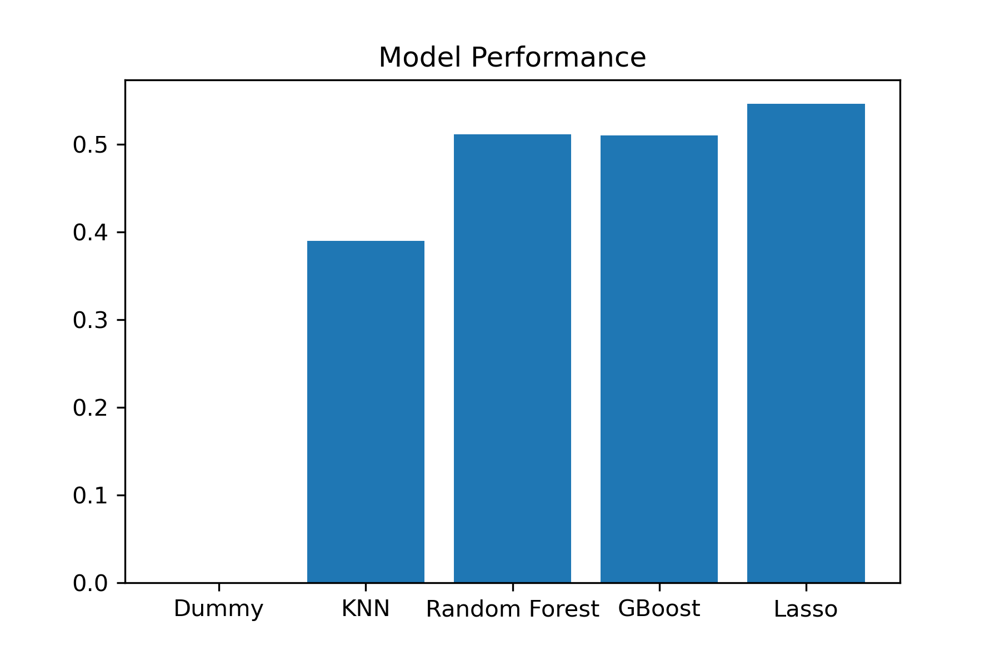

# Predicting Fantasy Football Scoring Using Machine Learning

Peter Burton

Link to my [presentation]( https://www.canva.com/design/DAFKNEEbdnk/NVK1ot99E-ZYseUANqe4Cg/edit?utm_content=DAFKNEEbdnk&utm_campaign=designshare&utm_medium=link2&utm_source=sharebutton)

## Introduction

My name is Peter Burton, and I am a data science student with flatiron. I have always enjoyed creating efficient solutions to problems and exploring how complicated systems fit together. These interests are what led me to pursue a degree in economics during my undergrad. I have pivoted this last year into exploring software and tech and trying to pair my background in economics and statistics with the programming chops to let me explore and analyze complex systems even more. Now that I am finishing up my data science bootcamp with flatiron, I am excited to start creating new projects and exploring new tools.

## Project Overview

I am beginning a project whose goal is creating a model that can help provide predictions and advice to Fantasy Football players. I have been introduced to the hobby by a sibling, and I am excited to see how the data science tools can be applied to a real world competition. The model I am building will use data from the last 4+ NFL seasons and use machine learning to create predictions for upcoming seasons that can help myself and other Fantasy Football Players make decisions regarding drafting, trading, or managing their team.

## Business Problem

Fantasy sports in North America are estimated to be a 26 Billion dollar industry(https://www.nbcnews.com/business/business-news/fantasy-sports-industry-numbers-n439536). Eclipsing even the yearly profits of the NFL. The largest and most lucrative fantasy sport is Fantasy Football, whose leagues are based on the NFL season each year. If You generousally include all of the time spent on fantasy football, you arrive at the outlandish figure of 70 Billion per year of value just in fantasy football(https://www.forbes.com/sites/briangoff/2013/08/20/the-70-billion-fantasy-football-market/?sh=71c11ec5755c).
Fantasy Football sometimes has players purchase entry into leagues that then reward top teams with cash prizes, or they can participate in bragging-rights-only leagues between friends or other fans.
Either way, the competitive nature of the hobby inspires a slew of blogs, podcasts, analysis, and of course, mostly banter between players.

Our model will give players in these leagues another tool to assess their fantasy football decisions and give them a competitive edge. Although players have a large amount of information at their fingertips, much of it is opinion based and based on the reaction or overreaction to recent news and can be subject to the bias of a human analyst.
A machine learning model that can sift through hundreds of players and thousands of games and find patterns, identify key metrics, and recommend players based on that data, can create a useful and unbiased tool for fantasy football participants. Although consistently and correctly predicting the Fantasy Football world is a lot like trying to predict the stock market, using statistical methods to predict fantasy ouput has shown to be effective(https://www.ijcaonline.org/archives/volume164/number4/27471-2017913614).

## Data Sourcing

All data for this project is sourced from https://www.pro-football-reference.com/. Particularly, the data is from the 2017, 2018, 2019, 2020, and 2021 Seasons. The data is uploaded in 5 separate CSV folders, one for each season, to this project's github repository.The Data we look at will include the relevant fantasy statistics for every active player in the NFL who scored fantasy points for each of those seasons. 

## Metrics

I have elected to use the PPR system as the scoring system of choice for two reasons. First, had has become one of the most standard scoring systems since it helps WRs have values closer to that of RBS in leagues. Second, my siblings created a PPR based fantasy football league and my performance last year was subpar to put it mildly.

## Data Cleaning and Feature Engineering

We cleaned up our data down to 1711 unique different individual's NFL seasons to model with. I will split my data into a training set and a test set, holding out 20 percent to evaluate our model at the end.

We want to be able to include team data in our model, since team culture, player talent surrounding a player, or offensive play calling can differ greatly between teams and can be a factor for player production. In order to analyze our categorical variables, we will convert the team each player was on, and the position that they play with one hot encoding

I one hot encoded team and position, and will do something similar with age. Since a value of 33 vs a value of 27 is not that different as an absolute value for are model, but it is very significant in determining an NFL players age, ie mid career vs close to retirement for most players, I divided up the ages of players into discrete bins. For the purpose of fantasy analysis, I am grouping players by 3 groups. Young players(<25), who are rookies or in their first 2 years of data in the league in most cases and establishing their value still. Mid-career players(25-29) who have established their performance and typically are not showing drop off yet, and late career players(30+) where each additional year in the league significantly increases the chance they will retire and is likely to decrease production.

## Modeling

Our Dummy model simple predicts the average fantasy point score of 89.2 for each player
I applied a grid search to a linear regression model with L1 regulization,  KNN, Random forest, and XGBoost models. Lasso proved to be an effective technique with our data since it is a method that helps reduce the dimensionality of our data. Since we have a lot of statistical data that is correlated, Lasso regression will allow us to deal with multicollinearity.

Based on our different Model performance we are selecting the Lasso Linear Regression Model as our final model. Let’s examine our residuals for that model as well. 

Or final model has an r-squared score of 0.546 on the training data, and 0.52 on the test data. In other words, just over half of the variance in a Fantasy Football players scoring in a season can be explained by our model. Although initially this doesn’t seem great, there are a number of high variance events that are very difficult to explain. For example, a healthy player may score 250 fantasy points in a season, and then due to a nagging hamstring injury that we have no data on, may drop to half of that the next season. Injury is the largest introducer of variance in our system that is unaddressed by the model, but there are many others, such as coaching staff changes, contract negotiations, off-field behavioral issues, etc.

## Results

Interestingly, our model is predicting for the 2022 season that Cooper Kupp will be the #1 overall PPR scorer, and Jonathon Taylor who is #1 on many fantasy ranking sites drops to #13. Other then Kupp, the top of our predictions is dominated by QBs, Lets dig in deeper and separate by position

- The top 5 QBs are Justin Herbert, Josh Allen, Patrick Mahomes, Tom Brady, and Aaron Rodgers
- The top 5 RBs are Jonathon Taylor, Austin Ekeler, Najee Hariss, Joe Mixon, and Leonard Fournette
- The Top 5 WRs are Cooper Kupp, Devante Adams, Justin Jefferson, Deebo Samuel, and Tyreek Hill
- The Top 5 TEs are Mark Andrews, Travis Kelce, Daltan Schultz, George Kittle, and Kyle Pitts

## Analysis

Since our model is predicting overall points and can be used as a drafting tool, it is interesting to compare its player rankings to current draft "ADP" values, the average draft positions across different fantasy sports websites. Although many sites have slightly different rankings, I will compare my results to a popular site that aggregates fantasy ADP rankings: fantasypros.com.

An obvious initial change in their rankings vs mine is my models rank of Cooper Kupp. Our model predicts that he will outperform not only other wide receivers, but also top running backs which have traditionally held a tight grip on the top draft position. In a typical league that runs either 2WR and 2RB with a flex, or 2RB and 3WR, which are both common setups, Kupp is the clear first pick based on our model. However, the overall ADP is 4th and the experts ranking for Kupp typically is always after McCaffrey, Taylor, and Ekeler.

Other early differences between the model and online rankings that are notable: Our model does not think you should draft McCaffrey early. Since he has 2 years of recent injury hampered seasons this is unsurprising. Our model highly ranks running backs such as Najee Harris(RB3 in our model vs RB6 in ADP rankings) and Darrel Williams(RB17 in our model compared to RB63 in ADP)

Looking back at Wide Receivers which our model rates differently than the ADP like Kupp, we see that Diontae Johnson is rated much higher at WR8 then his ADP of WR15. This is an interesting difference, as if you dig deeper into fantasy news, the early performance of young QB Kenny Pickett is extremely promising as well.

Finally, if we compare our top TE picks from our model to the Fantasy Pros ADP rankings, we can see that although there are no major outliers in the top 10 picks, Zach Ertz is rated in 6th in our model and grouped very close in predicted PPR to tight ends in that 4th-6th range, which would likely be worth drafting a round sooner then his TE10 ADP spot.

## Next Steps

Although the model does give a lot of input regarding draft picks, it also falls short in noticeable ways. One of the most obvious is its inability to predict or adjust for injury. But there are also a lot of "soft metrics" that can influence player performance. Contract negotiations and hold outs, coaching staff changes, teamates, off-field behavior etc.

There are also several weekly factors that weren’t included in seasonal data such as which defense they are playing, weather that day, home or away games, field type, etc.

Moving forward, I would like to transition this model into something similar, but with a target of a weekly instead of a seasonal PPR performance. A weekly model can still create seasonal predictions, or at least sums of weekly predictions, but it would allow me to introduce new features to improve the accuracy both in season long predictions and allow it to start creating weekly "start vs sit" decisions. Creating weekly value decisions has shown to be a relatively reliable of selecting winning football teams(https://ieeexplore.ieee.org/document/8367900).

In addition, adding NLP and scraping twitter for recent tweets on players could be a way to crowdsource wisdom regarding some of the "soft metrics" that are hard to introduce to a data frame. For example, a player with concerning off-field behavior, or a poor training camp performance will quickly draw negative fan attention, and the relative amount of negative vs positive fan tweets and frequency could be introduced into a model. In fact, some work has been done already to create a specific sentiment dataset with a lexicon trained for football fans, and their unique venaculer(https://www.researchgate.net/publication/329436134_Sentiment_Identification_in_Football-Specific_Tweets). In addition, it has been shown that twitter trends are usefyll in predicting not just fan sentiment, but match outcomes in the English Premier League(https://arxiv.org/ftp/arxiv/papers/1411/1411.1243.pdf), and in the NFL(https://arxiv.org/abs/1310.6998), and if it can predict game outcomes in ways that statistics fall short, applying them to player outcomes has promise as well.

## Conclusion

Our model is a useful tool for fantasy football players. It provides a way to predict PPR fantasy performance in a way that accounts for 52% of the variation in seasonal PPR performance. However, it must be taken with a grain of salt, since we don’t model every metric, and don’t have the most recent team news in the model. The best way to use the model is to highlight differences between the current fantasy rankings, and the model's rankings of players. If the ranking difference is likely because of recent news that our model hasn’t factored in, it is better to trust the consensus. However, in cases where there is not an additional factor to consider, the model can highlight players that might be undervalued or overvalued by the current fantasy rankings.
